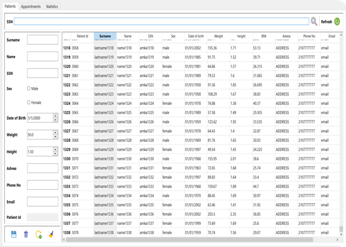

This project is about an Information System for PET scans time-scheduling. The desktop application allocates the patients to the available dates based on their BMI. After the implementation of the IS an average cost reduction of 22% was achieved. The reason of this reduction was the accurate radiological imaging drug dose calculation (and order), compared to the previous order model. The application was developed using exclusively Python, both for the frontend and the backend.

* Backend: Python
* Frontend: Python (PyQt5)
* Database: MySQL

# Patient screen

# Appointment screen

# Statistics screen

